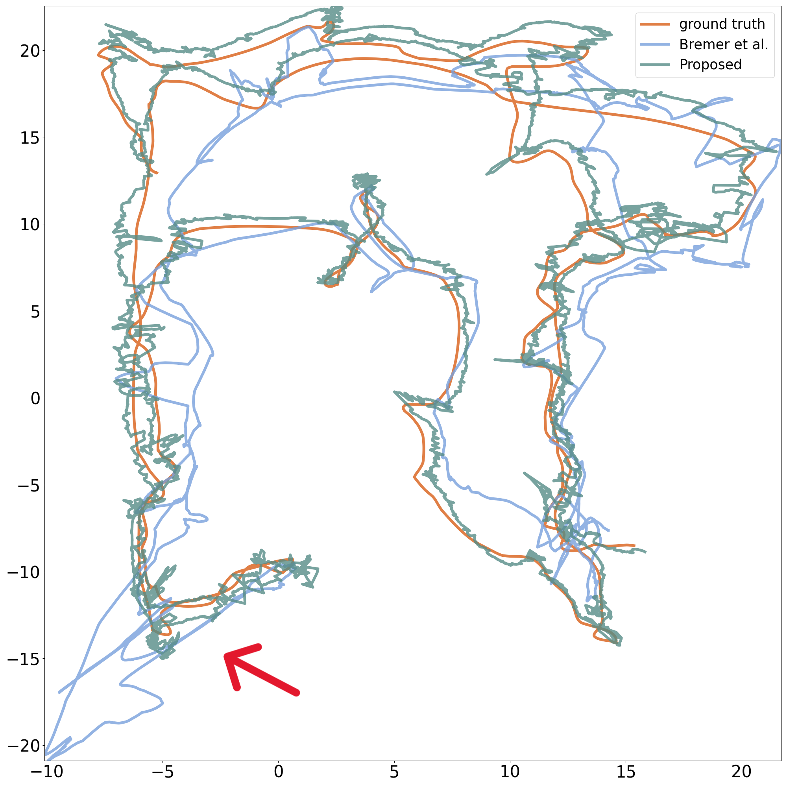
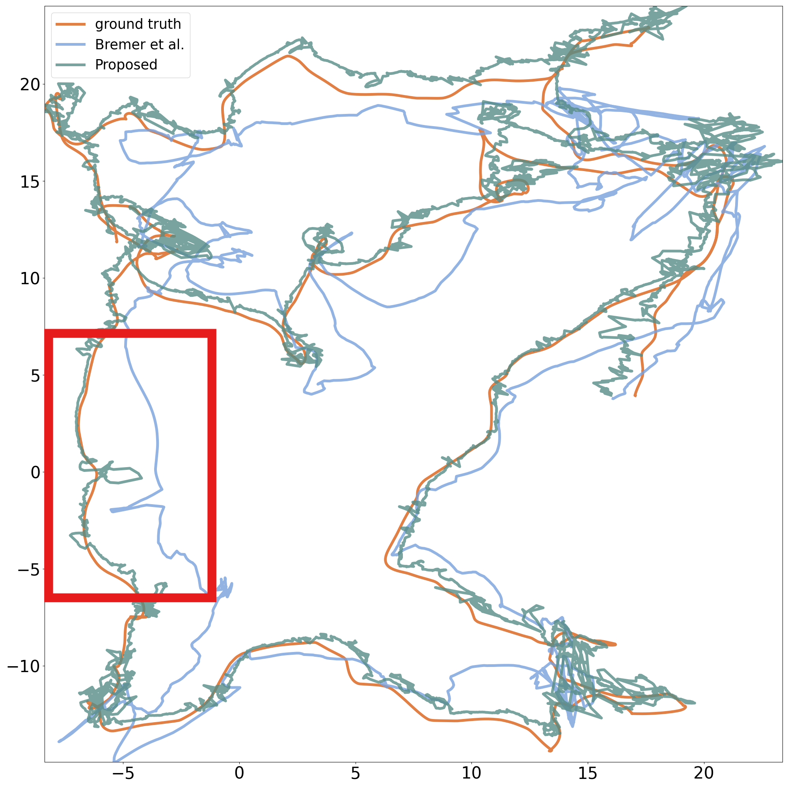
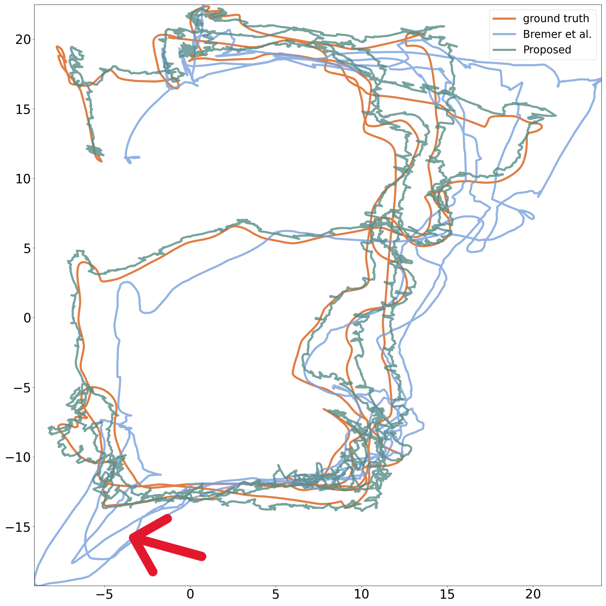
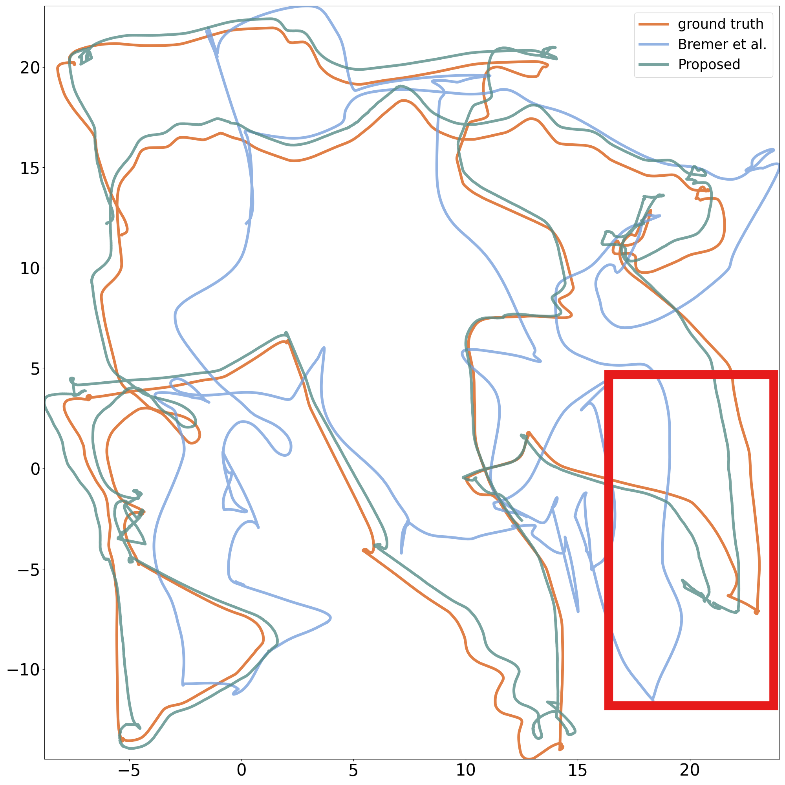
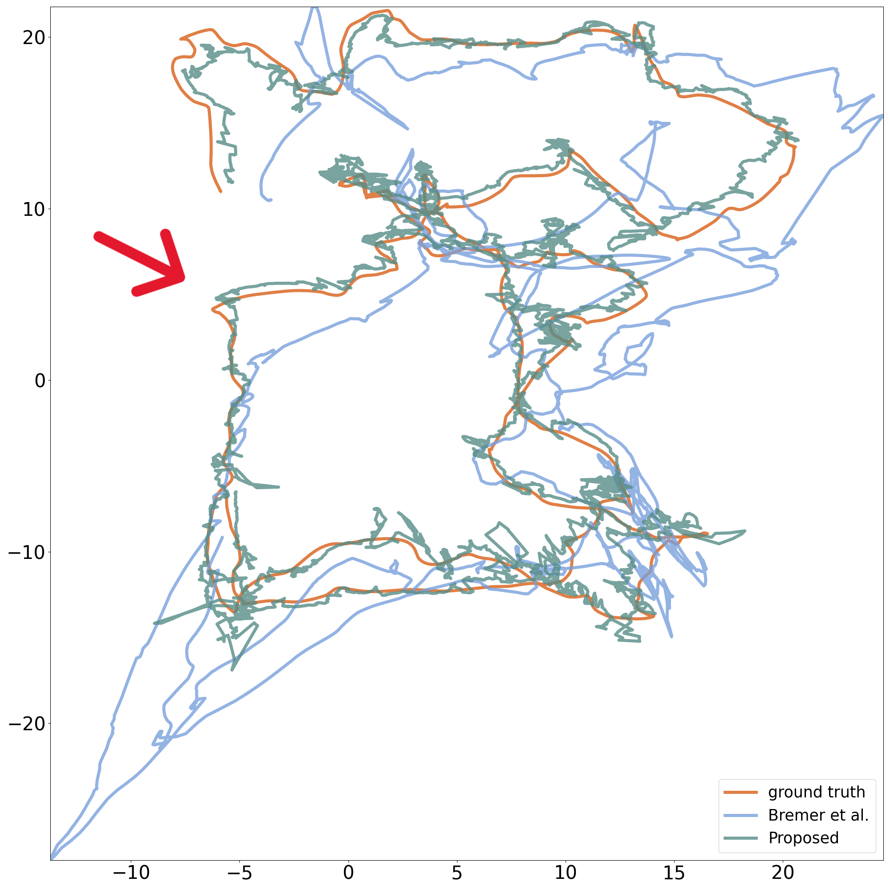
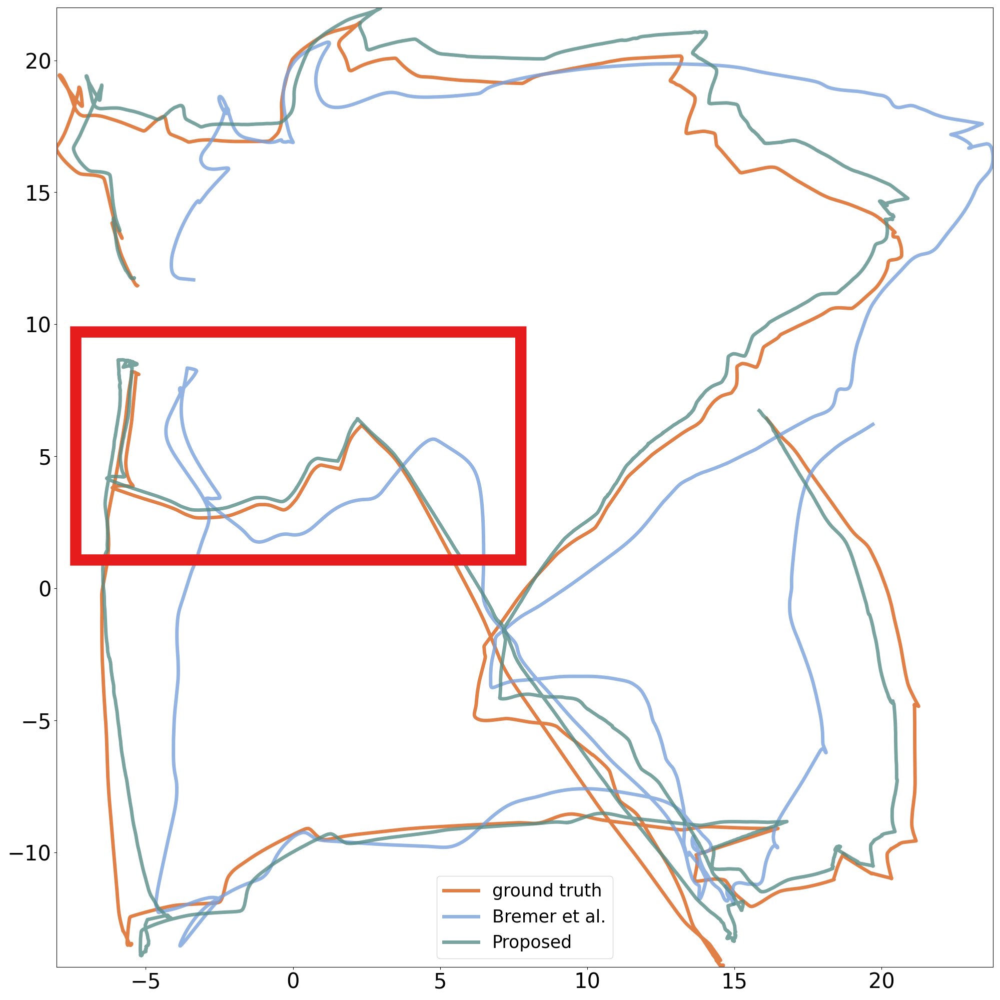

# basic-MyGO
a PyTorch implement of article ***MyGO: Virtual Reality Locomotion Prediction using Multitask Learning*** 
in The IEEE International Symposium on Mixed and Augmented Reality (ISMAR) 2025


## Context

- [Abstract](#abstract)
- [Model Architecture](#model-architecture)
- [Dependencies](#dependencies)
- [Example Results](#example-result)
- [Author](#author)
- [Acknowledge](#acknowledge)
- [Citation](#citation)

## Abstract

Locomotion is a fundamental interaction in Virtual Reality (VR). Current locomotion methods, such as redirected walking,
walkingin-place, and teleportation, make use of limited physical space and interaction mapping. However, there remains
significant potential for improvement, particularly in reducing equipment burden and enhancing immersion. To locate
these limitations, we rethink the procedure of VR walking interaction through the Human Information Processing paradigm.
Finding that the peripherals’ requirements and potential conflict in artificially designed interaction mappings are the
bottlenecks in bridging intention and action, we developed MyGO, an AI-assisted locomotion prediction method. MyGO
predicts users’ future trajectories from their subtle movements, collected only by a VR headset, using a multitask
learning (MTL) model. The proposed model demonstrates competitive results in both dataset validation and real-time
studies. The source code is available at https://github.com/ZichengLiu-seu/basic-MyGO

Key Word: Virtual Reality, Locomotion, Trajectory Prediction,
Multitask Learning

## Model Architecture
<figure>
    
</figure>

## Dependencies
```bash
pip install -r requirements.txt
```

## Example Result
Example of the prediction in real-time user study are shown as following:
<div style="display: flex; justify-content: space-between; width: 100%; margin-bottom:10px">
  
  
  
</div>

<div style="display: flex; justify-content: space-between; width: 100%;">
  
  
  
</div>

### Author
Liu Zicheng: liuzicheng /at seu.edu.cn, Ding Ding*: dingding-1 /at seu.edu.cn,
Li Zhuying@SEU, Shi Chuhan@SEU

 *Feel free to issue or contact us if you have any suggestions about this work!*

### Acknowledge

This work was support by Big Data Computing Center of Southeast University, Nanjing, China

### Citation
```bigquery
@inproceedings{LiuISMAR2025,
  author       = {Zicheng Liu and
                  Ding Ding and
                  Zhuying Li and
                  Chuhan Shi},
  title        = {MyGO: Virtual Reality Locomotion Prediction using Multitask Learning},
  booktitle    = {},
  pages        = {},
  publisher    = {IEEE},
  year         = {2025}
}
